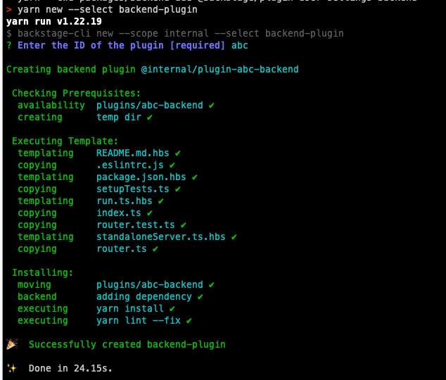
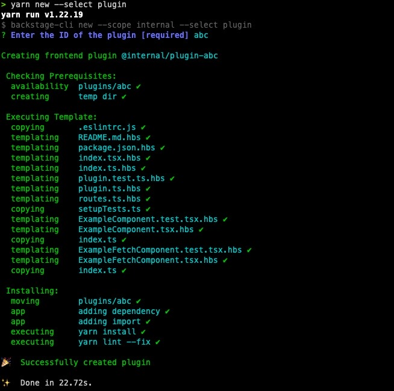

## Intro
Backstage comes with a number of core features already in place like Software Catalog, Software Templates, Backstage Search, and TechDocs. But it also provides the ability to easily add new features to your current spawend backstage instance through the plugins

Each plugin is treated as a self-contained web app and can include almost any type of content. Plugins all use a common set of platform APIs and reusable UI components. Plugins can fetch data from external sources using the regular browser APIs or by depending on external modules to do the work.

## Plugin Development
While there are already a number of open-source plugins on the official backstage website, I am going to explore creating my own Plugin just for better understanding the concept of extending the backstage platform. And for this I will construct a plugin that will gather information from an external source (I will use randomuser.me data as we get it from backstage scaffolded plugin), store it in the database, then create a `collator` to `instruct` `backstage-search-plugin` what data to index in order to make it available in Backstage Search page and finnaly return data into a new page in the Backstage app.

To summarize this, I will be creating:
    - one backend plugin
    - create a new database schema for this plugin and a migration file to ensure data structure will always be there 
    - one frontend plugin
    - modify the existing search page 
    - modify the existing App's layout (add new item in the left menu)
so, with this, let's get starting:

## I. Create Backend

### 1. Creating a Backend Plugin
We start with the instructions provided in Backstage’s Create a Backstage Plugin.

Running:
```bash
yarn new --select backend-plugin
```


will create our new backend plugin.

to run the plugins individually and independend of the backstage instage you can do so by running the following command
```shell
yarn workspace @internal/plugin-<<PLUGIN_ID>> start
```
To test to see if the backend api is working you can try running the curl command

```
curl http://localhost:7007/<<PLUGIN_ID>>/health
```
If everything is ok you should see a `{"status":"ok"}` message.

### 2. Define the router actions and create the controller
Open `/src/service/router.ts` file and add the following

```typescript
...

import { PluginDatabaseManager } from '@backstage/backend-common';
import { RandomUserController } from './controllers/RandomUserController';

export interface RouterOptions {
  logger: Logger;
  database: PluginDatabaseManager; // we will use a Database dependency for our plugin
}
...

const router = Router();
router.use(express.json());
...

  const randomUserController = await RandomUserController.fromConfig(options);
  
  router.put('/get-random-users', await randomUserController.getRandomUsers);
  
  router.get('/users', await randomUserController.getUsers);

  router.get('/users/:id', await randomUserController.getUsers);

  router.delete('/users/:id', await randomUserController.deleteUser);

  router.post('/users', await randomUserController.addUser);

```
then create the controller file in `/src/service/controllers/RandomUserController.ts`

```typescript
import { RouterOptions } from '../router';
import { DatabaseRandowUserStore } from '../../database';
import { RandomUserRow, RawUser } from '../../database/types';
import fetch from 'cross-fetch';

export class RandomUserController {
  private constructor(
    private options: RouterOptions,
    private dbHandler: DatabaseRandowUserStore,
  ) {
    this.getUsers = this.getUsers.bind(this);
    this.deleteUser = this.deleteUser.bind(this);
    this.getRandomUsers = this.getRandomUsers.bind(this);
    this.addUser = this.addUser.bind(this);
  }

  public static async fromConfig(options: RouterOptions) {
    const dbHandler = await DatabaseRandowUserStore.create(options.database);
    return new RandomUserController(options, dbHandler);
  }

  public async getUsers(req, response, _) {
    try {
      const userId: string = req.params.id || '';
      let data: RandomUserRow | RandomUserRow[];
      if (userId) {
        data = await this.dbHandler.get(userId);
      } else {
        data = await this.dbHandler.getAllByFilter(req.query);
      }
      response.send(data);
    } catch (err) {
      response
        .status(500)
        .send({ status: 'nok', message: 'An error has occured' });
    }
  }

  public async getRandomUsers(_, response) {
    try {
      const results = await fetch('https://randomuser.me/api/?results=50');
      const data = await results.json();
      await this.dbHandler.transaction(async tx => {
        await this.dbHandler.insert(tx, data.results as RawUser[]);
      });
      response.send(data.results);
    } catch (err) {
      response
        .status(500)
        .send({ status: 'nok', message: 'An error has occured' });
    }
  }

  public async deleteUser(req, response, _) {
    try {
      console.log('GGG');
      const userId: string = req.params.id || '';
      await this.dbHandler.delete(userId);
      response.status(204).send();
    } catch (err) {
      response.status(404).send({ status: 'nok', message: 'User not found' });
    }
  }

  public async addUser(req, response, _) {
    // we should get a same data structure as when getting random users
    const rawUsers = [req.body];

    try {
      await this.dbHandler.transaction(async tx => {
        await this.dbHandler.insert(tx, rawUsers as RawUser[]);
      });
    } catch (err) {
      response
        .status(500)
        .send({ status: 'nok', message: 'An error has occured' });
    }
  }
}
```
Now that you've added the controller, you need to create the Database handler for it to work

### 3. Create the Database store handler
Add `src/database/DatabaseRandowUserStore.ts`
```typescript
import { apiOptions, RandomUserRow, RawUser } from './types';

import { v4 as uuid } from 'uuid';

import {
  PluginDatabaseManager,
} from '@backstage/backend-common';

import { Knex } from 'knex';
import { applyDatabaseMigrations } from './migrations';

export class DatabaseRandowUserStore {
  private constructor(private readonly db: Knex) {}
  private readonly LIMIT = 500;

  public static async create(
    database: PluginDatabaseManager,
  ): Promise<DatabaseRandowUserStore> {
    const knex = await database.getClient();

    if (!database.migrations?.skip) {
      await applyDatabaseMigrations(knex);
    }
    return new DatabaseRandowUserStore(knex);
  }

  async transaction<T>(fn: (tx: Knex.Transaction) => Promise<T>): Promise<T> {
    return await this.db.transaction(fn);
  }

  async getTransaction(): Promise<Knex.Transaction> {
    return this.db.transaction();
  }

  public async insert(tx: Knex.Transaction, randomUsers: RawUser[]) {
    await tx('random_user').insert(
        randomUsers.map(randomUser => ({
            first_name: randomUser.name.first,
            last_name: randomUser.name.last,
            email: randomUser.email,
            phone: randomUser.phone,
            avatar: randomUser.picture.medium,
            nat: randomUser.nat,
            gender: randomUser.gender,
            id: uuid(),
            target: randomUser.location?.state ?? ""
        })),
      );
  }

  public async getAll(): Promise<RandomUserRow[]> {
    return await this.db('random_user')
        .select('*');
  }

  public async getAllByFilter(options: apiOptions): Promise<RandomUserRow[]> {
    const query = this.db('random_user')
        .select('*')
        .limit(options.limit || this.LIMIT, {skipBinding: true})
        .offset(options.offset || 0);
    return await query;
  }

  public async get(id: string): Promise<RandomUserRow[]> {
    return await this.db('random_user')
        .select('*')
        .where('id', id)
        .first();
  }

  public async delete(id: string): Promise<number> {
    return await this.db('random_user')
        .where('id', id)
        .del();
  }
}
```
After you create this class you need to define the types that are used by the plugin.
To do so create a new file `src/database/types.ts`

```typescript
// This is the structure that will be exposed by our API further to FE plugin
export type RandomUserRow = {
    id: string;
    first_name: string;
    last_name: string;
    email: string;
    phone?: string;
    avatar?: string;
    nat?: string;
    gender: "male" | "female";
    target: string;
}
// This is how RandomUser exposes data when querying
export type RawUser = {
    gender: string; // "male"
    name: {
      title: string; // "Mr",
      first: string; // "Duane",
      last: string; // "Reed"
    };
    location: {state: string}; // {street: {number: 5060, name: "Hickory Creek Dr"}, city: "Albany", state: "New South Wales",…}
    email: string; // "duane.reed@example.com"
    login: object; // {uuid: "4b785022-9a23-4ab9-8a23-cb3fb43969a9", username: "blackdog796", password: "patch",…}
    dob: object; // {date: "1983-06-22T12:30:23.016Z", age: 37}
    registered: object; // {date: "2006-06-13T18:48:28.037Z", age: 14}
    phone: string; // "07-2154-5651"
    cell: string; // "0405-592-879"
    id: {
      name: string; // "TFN",
      value: string; // "796260432"
    };
    picture: { medium: string }; // {medium: "https://randomuser.me/api/portraits/men/95.jpg",…}
    nat: string; // "AU"
  };

/**
 * Fields that can be used to filter or order RandomUsers items.
 *
 * @public
 */
export type RandomUserFields = 'id' | 'first_name' | 'last_name' | 'email';

export type apiOptions = {
  offset?: number;
  limit?: number;
  orderBy?: {
    field: RandomUserFields;
    direction: 'asc' | 'desc';
  };
  filters?: {
    field: RandomUserFields;
    /** Value to filter by, with '*' used as wildcard */
    value: string;
  }[];
};
```

### 4. Create the Database table structure
Right now we have a type definition of how the data should be represented in our datanase; However the table is still not created.
On this step we need to create a migrtion functionality. Add `/src/database/migrations.ts`
```typescript
import { resolvePackagePath } from '@backstage/backend-common';
import { Knex } from 'knex';

export async function applyDatabaseMigrations(knex: Knex): Promise<void> {
  const migrationsDir = resolvePackagePath(
    '@internal/plugin-first-backend',
    'migrations',
  );

  await knex.migrate.latest({
    directory: migrationsDir,
  });
}
```
This is how we will instruct backstage where to look for the migration files and now we should add the file with the data structure that we need. 

To do so create a folder named `/migrations` outside the `/src` into the root of the plugin structure and add a file to it. I prefer adding a timestamp in front of it + a short descrition `<<PLUGIN_ID>>/migrations/20221017153900_init.js` but it doesn't matter. Once backstage uses this file, you will see an entry in the knex_migrations table with name and the migreation_time when was loaded.

```javascript
/**
 * @param {import('knex').Knex} knex
 */
 exports.up = async function up(knex) {
    return (
      knex.schema
        // randomUser
        .createTable('random_user', table => {
          table.comment('Main table for storing random users');
          table
            .uuid('id')
            .primary()
            .notNullable()
            .comment('Auto-generated ID of the user');
          table.string('first_name').notNullable();
          table.string('last_name').notNullable();
          table.string('email').notNullable();
          table.string('phone');
          table.string('avatar');
          table.string('gender');
          table.string('nat');
          table
            .string('target')
            .notNullable()
            .comment('The actual target of the location');
        })
        .alterTable('random_user', table => {
          table.unique(['email'], {
            indexName: 'radom_user_email_uniq',
          });
        })
    );
  };
  
  /**
   * @param {import('knex').Knex} knex
   */
  exports.down = async function down(knex) {
    return knex.schema
      .alterTable('random_user', table => {
        table.dropUnique([], 'radom_user_email_uniq');
      })
      .dropTable('random_user');
  };
```

### 5. Link plugin with the backstage-app
Because we've added the a database dependency to our plugin, the `standaloneServer.ts` is not functioning anymore. In order to fix it, we need to instruct on how to get DataBase settings.
edit the and add a database `/src/service/standaloneServer.ts`

```typescript
  const databaseManager = DatabaseManager.fromConfig(config, {
    logger: logger,
  });
  const database: PluginDatabaseManager = databaseManager.forPlugin('random-user');

  const router = await createRouter({
    logger,
    database,
  });
```

with fixing the standalone servver of the plugin we should now proceed to link to the backstage backend package
add a new file to `/packages/backend/src/plugins/random-user.ts`
```typescript
import { createRouter } from '@internal/plugin-random-user-backend';
import { Router } from 'express';
import { PluginEnvironment } from '../types';

export default async function createPlugin(
  env: PluginEnvironment,
): Promise<Router> {
  return await createRouter({
    logger: env.logger,
    database: env.database,
  });
}
```

and add the dependency inside /packages/backedn/package.json
```json
"@internal/plugin-random-user-backend": "^0.1.0",
```

then go to `packages/backend/src/index.ts` to make it discovarable
```typescript
import randomUser from './plugins/random-user-backend';
// ....

    const randomUserEnv = useHotMemoize(module, () => createEnv('randomUser'));

    // ...
        const apiRouter = Router();
        // ...
        apiRouter.use('/random-user', await first(randomUserEnv));

```
and with this last piece you link your plugin router to your backstage app instance  API' router.


## II. Create Frontend
The process for creating a frontend plugin is a little bit different because after you finish running the create plugin command, the plugin it's already injected into the backstage instance app. You don't need to do any extra steps as was the case for a backend plugin.

### 1. Create a frontend plugin

```bash
yarn new --select plugin
```


that's it; run the command and you'll see the plugin available `http:localhost:3000/random-user`
```shell
yarn workspace @internal/plugin-<<PLUGIN_ID>> start
```
### 2. Create a client API to consume the service created
Similar as for the backend plugin lets create these files 
`/src/api/client.ts`
`/src/api/types.ts`
`/src/api/index.ts`

```typescript
// api/client.ts
import { IRandomUserApi } from './types';
import { RandomUserApiOptions, RandomUserApiResult, RandomUserItem } from './types';
import { DiscoveryApi, IdentityApi } from '@backstage/core-plugin-api';
import { ResponseError } from '@backstage/errors';

/**
 * Options for creating a RandomUser client.
 *
 * @public
 */
export interface IRandomUserClientOptions {
  discoveryApi: DiscoveryApi;
  identityApi: IdentityApi;
}

export class RandomUserClient implements IRandomUserApi {
  private readonly discoveryApi: DiscoveryApi;
  private readonly identityApi: IdentityApi;

  constructor(options: IRandomUserClientOptions) {
    this.discoveryApi = options.discoveryApi;
    this.identityApi = options.identityApi;
  }

  public async getAll(options: RandomUserApiOptions): Promise<RandomUserApiResult> {
    const { offset, limit, orderBy, filters } = options;
    const baseUrl = await this.discoveryApi.getBaseUrl('RandomUser');
    const { token } = await this.identityApi.getCredentials();

    const query = new URLSearchParams();

    if (typeof offset === 'number') {
      query.set('offset', String(offset));
    }
    if (typeof limit === 'number') {
      query.set('limit', String(limit));
    }
    if (orderBy) {
      query.set('orderBy', `${orderBy.field}=${orderBy.direction}`);
    }
    if (filters) {
      for (const filter of filters) {
        query.append('filter', `${filter.field}=${filter.value}`);
      }
    }

    const res = await fetch(`${baseUrl}/users?${query}`, {
      headers: token
        ? {
            Authorization: `Bearer ${token}`,
          }
        : undefined,
    });

    if (!res.ok) {
      throw await ResponseError.fromResponse(res);
    }

    const data: RandomUserItem[] = await res.json();
    return {
        items: data,
        totalCount: 10000,
        offset: 0,
        limit: 30
    }
  }

  public async getById(id: string): Promise<RandomUserApiResult> {
    const baseUrl = await this.discoveryApi.getBaseUrl('RandomUser');
    const { token } = await this.identityApi.getCredentials();

    const res = await fetch(`${baseUrl}/users/${id}`, {
        headers: token
          ? {
              Authorization: `Bearer ${token}`,
            }
          : undefined,
      });
    if (!res.ok) {
        throw await ResponseError.fromResponse(res);
      }
  
      const data: RandomUserItem = await res.json();
      return {
          items: [data],
          totalCount: 1,
          offset: 0,
          limit: 1
      }
  }
}
```

```typescript
// api/types.ts
import { createApiRef } from '@backstage/core-plugin-api';
/**
 * Structure of RandomUser
 */
export type RandomUserItem = {
  id: string;
  first_name: string;
  last_name: string;
  email: string;
  phone?: string;
  avatar?: string;
  nat?: string;
  gender: 'male' | 'female';
  target: string;
};

/**
 * Fields that can be used to filter or order RandomUsers items.
 *
 * @public
 */
export type RandomUserFields = 'id' | 'first_name' | 'last_name' | 'email';
/**
 * Options used to list RandomUserAPI items.
 *
 * @public
 */
export type RandomUserApiOptions = {
  offset?: number;
  limit?: number;
  orderBy?: {
    field: RandomUserFields;
    direction: 'asc' | 'desc';
  };
  filters?: {
    field: RandomUserFields;
    /** Value to filter by, with '*' used as wildcard */
    value: string;
  }[];
};

/**
 * The result of listing random users.
 *
 * @public
 */
export type RandomUserApiResult = {
  items: RandomUserItem[];
  totalCount: number;
  offset: number;
  limit: number;
};

/**
 * The API used by the random-user-plugin to list all random users.
 *
 * @public
 */
export interface IRandomUserApi {
  /**
   * Lists all random_users items.
   *
   * @public
   */
  getAll(options?: RandomUserApiOptions): Promise<RandomUserApiResult>;
  getById(id: string): Promise<RandomUserApiResult>;
}

/**
 * ApiRef for the RandomUserApi.
 *
 * @public
 */
export const randomUserApiRef = createApiRef<IRandomUserApi>({
  id: 'plugin.randomUser.api',
});
```

```typescript
// index.ts
export { RandomUserClient } from './client';
export type { IRandomUserClientOptions } from './client';
export { randomUserApiRef } from './types';
export type {
  IRandomUserApi,
  RandomUserApiOptions,
  RandomUserApiResult,
  RandomUserItem,
  RandomUserFields,
} from './types';
```

### 3. Expose the changes 
`/src/plugin.ts`
```typescript
import { randomUserApiRef, RandomUserClient } from './api';
import {
  createApiFactory,
  createPlugin,
  createRoutableExtension,
  discoveryApiRef,
  identityApiRef,
} from '@backstage/core-plugin-api';
// ...

export const randomUserPlugin = createPlugin({
    id: 'random-user',
    apis: [
        createApiFactory({
        api: randomUserApiRef,
        deps: {
            identityApi: identityApiRef,
            discoveryApi: discoveryApiRef,
        },
        factory({ identityApi, discoveryApi }) {
            return new RandomUserClient({ identityApi, discoveryApi });
        },
        }),
    ],
//...

```

### 4. Modify the layout provided
`in /components/ExampleFetchComponent/ExampleFetchComponent.tsx`
```typescript
import React from 'react';
import { makeStyles } from '@material-ui/core/styles';
import { Table, TableColumn, Progress } from '@backstage/core-components';
import Alert from '@material-ui/lab/Alert';
import useAsync from 'react-use/lib/useAsync';
import { useApi } from '@backstage/core-plugin-api';

import {
  RandomUserApiOptions,
  RandomUserApiResult,
  RandomUserItem,
  randomUserApiRef,
} from '../../api';
const PAGE_SIZE = 30;

const useStyles = makeStyles({
  avatar: {
    height: 32,
    width: 32,
    borderRadius: '50%',
  },
});

type DenseTableProps = {
  users: RandomUserItem[];
};

export const DenseTable = ({ users }: DenseTableProps) => {
  const classes = useStyles();

  const columns: TableColumn[] = [
    { title: 'Avatar', field: 'avatar' },
    { title: 'Name', field: 'name' },
    { title: 'Email', field: 'email' },
    { title: 'Nationality', field: 'nationality' },
  ];

  const data = users.map(user => {
    return {
      avatar: (
        
      ),
      name: `${user.first_name} ${user.last_name}`,
      email: user.email,
      nationality: user.nat,
    };
  });

  return (
    <Table
      title="Example User List (fetching data from randomuser.me)"
      options={{ search: false, paging: false }}
      columns={columns}
      data={data}
    />
  );
};

export const ExampleFetchComponent = () => {
  const { value, loading, error } = getRandomUserData();

  if (loading) {
    return <Progress />;
  } else if (error) {
    return <Alert severity="error">{error.message}</Alert>;
  }

  return <DenseTable users={value?.data || []} />;
};

//...
export const getRandomUserData = () => {
  return useAsync(async () => {
    const randomUserApi = useApi(randomUserApiRef);
    const searchParams = new URLSearchParams(window.location.search);
    const query: any = {};
    // Display the key/value pairs
    for (const [key, value] of searchParams.entries()) {
      query[key] = value;
    }
    let result = {} as RandomUserApiResult;
    const id = searchParams.get('id') || null;
    if (id) {
      result = await randomUserApi.getById(id || '');
    } else {
      const page = query?.page ?? 0;
      const pageSize = query?.pageSize ?? PAGE_SIZE;
      result = await randomUserApi.getAll({
        offset: page * pageSize,
        limit: 10000, // pageSize,
        orderBy:
          query?.orderBy &&
          ({
            field: query.orderBy.field,
            direction: query.orderDirection,
          } as RandomUserApiOptions['orderBy']),
        filters: query?.filters?.map(
          (filter: { column: { field: any }; value: any }) => ({
            field: filter.column.field!,
            value: `*${filter.value}*`,
          }),
        ) as RandomUserApiOptions['filters'],
      });
    }

    return {
      data: result.items as RandomUserItem[],
      totalCount: result.totalCount,
      page: Math.floor(result.offset / result.limit),
    };
  }, []);
};

```

